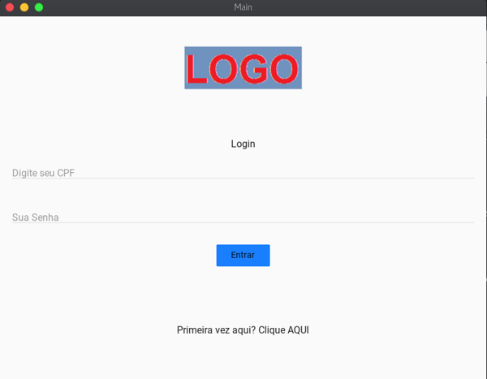

# Cliente-ispfy
Aplicativo integrado com a api do sistema ISPFY para Provedores de internet

Aplicativo escrito em python3.6 utilizando a biblioteca kivy e kivymd.
 
Ele consome uma Api-REST do sistema <a href="https://www.ispfy.com.br/">ISPFY - Sistemas de Gestão para Provedores</a>.
 
Foi pensado para o Cliente fazer login, e consultar seus debitos e gerar o código para pagamento das mensalidades.
 
Utilizando um visual bem Intuitivo, visando a facilidade dos úsuarios.
 
Link da API, <a href="https://github.com/codize/ispfy-api-client">aqui.</a>
<h3>Como rodar o codigo na sua maquina </h3>

Para começar instale o Python em sua versao 3.6 ou 3.7 que são as versões em que foram testadas o app,
você pode seguir os passos do próprio site do <a href="https://www.python.org/">python</a>

Após isso você deverá criar um ambiente virtual com python e ativar esse ambiente.
        
utilize os comandos no seu terminal.
 

    <code>
        python3 -m venv venv 
    </code>
     
    <code>
        source venv/bin/activate
    </code>

 
O kivy precisa de algumas dependencias do sistema para rodar, então sugiro que instale ele seguindo as orientações do seu próprio site.<a href="https://kivy.org/doc/stable/gettingstarted/installation.html"> Clique aqui</a>
 
 
Após instalado rode o comando para instalar o kivymd.
 
  

    <code>
        pip install kivymd
    </code>
  

  

 Com o ambiente pronto faça a clonagem desse repositório na sua maquina e rode o comando:

    <code>
        python main.py
    </code>

 
Se tudo der certo deverá aparecer a imagem do app.

Para fazer login dera utilizar os dados fornecidos na documentação do Ispfy 

Para usuario coloque:

Cpf = 99745928000162
 
Senha = e10adc3949ba59abbe56e057f20f883e
  
Senha do cliente na central do assinante em MD5

E pronto.
